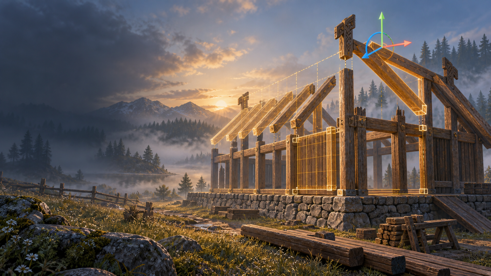
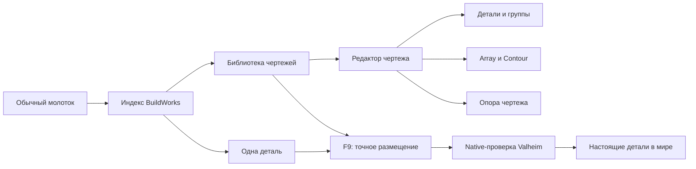

# BuildWorks

> Альфа 0.19.33 для Valheim 1.0. Автоматические проверки пройдены; ручная игровая проверка 0.19.33 ещё продолжается.



BuildWorks — конструктор точного строительства для Valheim. Он расширяет обычный молоток индексным каталогом, позволяет собирать составные чертежи в отдельном редакторе и точно размещать детали или весь чертёж в мире.

Главная идея: игрок по-прежнему строит настоящими деталями Valheim. BuildWorks не заменяет постройку одной декоративной моделью и не изменяет землю скрытно.



## Что уже работает

- индексный интерфейс молотка: категории, материалы, недавнее, избранное, поиск и чертежи;
- создание чертежа из деталей мира или с нуля;
- отдельный редактор с каталогом, камерой, сеткой, деревом объектов и Undo/Redo;
- точные перемещение, вращение по трём осям и равномерный масштаб;
- группы, вложенность, локальная опора группы и отдельная мировая опора чертежа;
- Array: ряд/плоскость, Pack/Fit/точный шаг, подъём, поворот, наклон, крен, масштаб и симметрия;
- Contour: повтор выбранной детали или группы вдоль связанной цепочки;
- мировое F9-редактирование детали или составного чертежа;
- последовательная установка настоящих деталей с обычными ресурсами, правами и ограничениями Valheim.

Полное описание: [функции и взаимодействия](docs/FEATURES_RU.md), [управление](docs/CONTROLS_RU.md), [установка](docs/INSTALL_RU.md), [ROADMAP](docs/ROADMAP_RU.md).

## Статус альфы

0.19.33 прошла Release build без ошибок и предупреждений, Geometry 104, Store, EditorBridge, WorldLayout, HostContract и Unity Workbench 81/81. Последние изменения точек привязки, контакта скосов/крыш/мебели и начального режима Array требуют ручного smoke в Valheim.

Подробности: [статус 0.19.33](docs/ALPHA_0.19.33_RU.md).

## Лицензия и Pull Request

BuildWorks — proprietary/source-available проект, а не open-source. Официальную DLL разрешено устанавливать для личного некоммерческого тестирования. Код можно просматривать и делать fork для подготовки Pull Request; любое включение кода или оригинальных материалов в другой проект, распространение либо коммерческое использование требует предварительного письменного разрешения владельца.

Полные условия: [LICENSE](LICENSE). Предложить исправление: [CONTRIBUTING.md](CONTRIBUTING.md).

## Зависимости

- Valheim;
- BepInExPack Valheim 5.4.x.

Jotunn, TerrainRamp и EarthWorks не являются зависимостями BuildWorks.

## Сборка из исходников

Нужны .NET SDK, установленный Valheim и BepInExPack. BuildWorks напрямую компилируется против host assemblies Valheim, поэтому укажите локальные пути без добавления игровых DLL в репозиторий:

```powershell
dotnet build .\src\BuildWorks\BuildWorks.csproj -c Release `
  -p:ProfileRoot="C:\path\to\BepInEx-profile" `
  -p:ValheimManagedDir="C:\path\to\Valheim\valheim_Data\Managed"
```

Детерминированные проверки геометрии:

```powershell
dotnet run --project .\tests\BuildWorks.GeometryTests\BuildWorks.GeometryTests.csproj -c Release
```

## Важное ограничение

Это ранняя альфа для тестирования, не стабильный публичный релиз. Перед использованием сделайте резервную копию мира и персонажа. Multiplayer, полный save/reload-набор, импорт/экспорт чертежей и будущие процедурные кривые ещё не прошли финальные ворота.

Концептуальная обложка выше создана для репозитория и не является игровым скриншотом. Остальные изображения документации — снимки фактического интерфейса из Unity Workbench.

Происхождение изображений описано в [IMAGES.md](docs/IMAGES.md).
