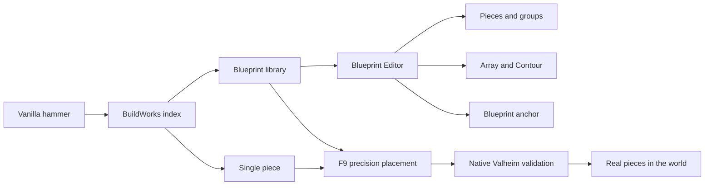

# BuildWorks

**English** | [Русский](README_RU.md)

> Alpha 0.19.33 for Valheim 1.0. Automated checks pass; the manual in-game validation of 0.19.33 is still in progress.


BuildWorks is a precision construction toolkit for Valheim. It extends the regular hammer with an indexed catalog, lets players assemble composite blueprints in a dedicated editor, and provides precise placement for individual pieces or an entire blueprint in the world.

The central rule is simple: players still build real Valheim pieces. BuildWorks does not replace a structure with one decorative model and does not alter terrain behind the scenes.



## What works now

- indexed hammer UI with categories, materials, recents, favorites, search, and blueprints;
- creating a blueprint from world pieces or from an empty document;
- a dedicated editor with a catalog, camera, grid, object tree, and Undo/Redo;
- precise translation, three-axis rotation, and uniform scaling;
- groups, nesting, local group anchors, and a separate world anchor for the blueprint;
- Array with line/plane layouts, Pack/Fit/exact spacing, rise, heading, pitch, roll, scale step, and symmetry;
- Contour repetition of a selected piece or group along a connected chain;
- F9 world editing for a piece or composite blueprint;
- sequential construction of real pieces using normal Valheim resources, permissions, and restrictions.

Full documentation: [features and interactions](docs/FEATURES.md), [controls](docs/CONTROLS.md), [installation](docs/INSTALL.md), and [roadmap](docs/ROADMAP.md).

## Alpha status

Version 0.19.33 passes a Release build with zero errors and warnings, Geometry 104, Store, EditorBridge, WorldLayout, HostContract, and Unity Workbench 81/81. The latest snap-point, slope/roof/furniture contact, and initial Array-mode changes still require a manual smoke test in Valheim.

See [the 0.19.33 status report](docs/ALPHA_0.19.33.md).

## License and pull requests

BuildWorks is proprietary/source-available software, not open-source software. The official binaries may be installed for personal, non-commercial testing. You may inspect and fork the source solely to prepare a pull request. Reusing BuildWorks code or original materials in another project, redistributing them, or using them commercially requires prior written permission from the owner.

See [LICENSE](LICENSE) for the complete terms and [CONTRIBUTING.md](CONTRIBUTING.md) to propose a change.

## Dependencies

- Valheim;
- BepInExPack Valheim 5.4.x.

Jotunn, TerrainRamp, and EarthWorks are not BuildWorks dependencies.

## Building from source

You need the .NET SDK, an installed copy of Valheim, and BepInExPack. BuildWorks compiles directly against Valheim host assemblies, so provide local paths without committing game DLLs to the repository:

```powershell
dotnet build .\src\BuildWorks\BuildWorks.csproj -c Release `
  -p:ProfileRoot="C:\path\to\BepInEx-profile" `
  -p:ValheimManagedDir="C:\path\to\Valheim\valheim_Data\Managed"
```

Deterministic geometry checks:

```powershell
dotnet run --project .\tests\BuildWorks.GeometryTests\BuildWorks.GeometryTests.csproj -c Release
```

## Important limitation

This is an early testing alpha, not a stable public release. Back up the world and character before use. Multiplayer, the complete save/exit/reload matrix, blueprint import/export, and future procedural curves have not passed their final gates.

The concept cover above was created for this repository and is not an in-game screenshot. The remaining documentation images are captures of the implemented UI from the Unity Workbench. See [IMAGES.md](docs/IMAGES.md) for provenance.
