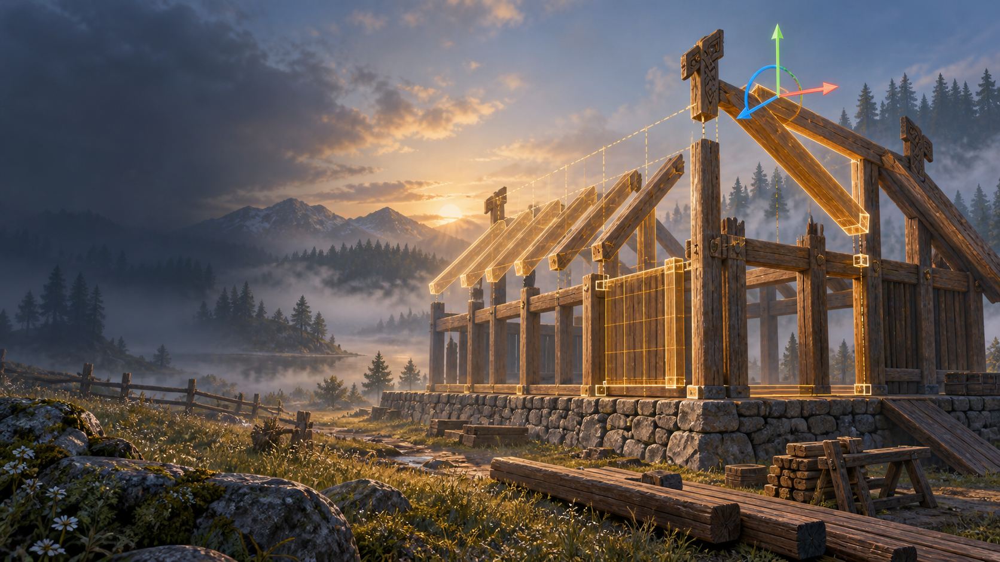
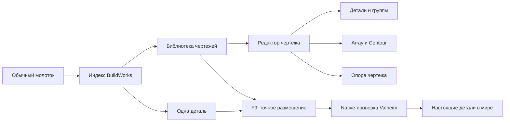

# BuildWorks

[English](README.md) | **Русский**

> Кандидат в исходниках 0.19.49 для Valheim 1.0.16. Последний существующий бинарный prerelease остаётся 0.19.37; новый бинарный релиз этим проходом не публикуется. Игровые тесты — только TerrainRamp-1.0-Test; опоры точек, рабочие оси, экранный/3D размер гизмы и ванильные карточки ресурсов ожидают проверки владельца в игре.



BuildWorks — конструктор точного строительства для Valheim. Он расширяет обычный молоток индексным каталогом, позволяет собирать составные чертежи в отдельном редакторе и точно размещать детали или весь чертёж в мире.

Главная идея: игрок по-прежнему строит настоящими деталями Valheim. BuildWorks не заменяет постройку одной декоративной моделью и не изменяет землю скрытно.



## Что уже работает

- индексный интерфейс молотка: категории, материалы, недавнее, избранное, поиск и чертежи;
- создание чертежа из деталей мира или с нуля;
- отдельный редактор с каталогом, камерой, сеткой, деревом объектов и Undo/Redo;
- точные перемещение, вращение по трём осям и равномерный масштаб;
- постоянная подпись текущего Q/E-режима и видимые точки соседних деталей в радиусе 2 м без изменения магнитного порога 0,55 м;
- группы, вложенность, локальная опора группы и отдельная мировая опора чертежа;
- Array: ряд/плоскость, Pack/Fit/точный шаг, подъём, поворот, наклон, крен, масштаб и симметрия;
- Contour: повтор выбранной детали или группы вдоль связанной цепочки;
- мировое F9-редактирование детали или составного чертежа;
- последовательная установка настоящих деталей с обычными ресурсами, правами и ограничениями Valheim.
- English-first runtime-локализация с полным русским каталогом.

Полное описание: [функции и взаимодействия](docs/FEATURES_RU.md), [управление](docs/CONTROLS_RU.md), [архитектура](docs/ARCHITECTURE_RU.md), [локализация](docs/LOCALIZATION_RU.md), [установка](docs/INSTALL_RU.md), [ROADMAP](docs/ROADMAP_RU.md).

## Статус альфы

Кандидат 0.19.41 закрепляет линию контура на полных рёбрах, полностью убирает перекрытия редактора через F7/кнопку, разбивает подсказки на шесть групп, добавляет угол обзора со сбросом к игре и компактное дерево с отметками опор, колонками глаза/замка и полосой прокрутки. Пройдены Release, geometry/store/localization, editor bridge, world layout, host/защита установки и 81 новый снимок Unity Workbench с проверками ввода. Точечная игровая серия и multiplayer остаются воротами Ostrix.

Подробности: [дорожная карта](docs/ROADMAP_RU.md), [текущая приёмка](specs/roadmap/current-pass_RU.md). [Статус 0.19.37](docs/ALPHA_0.19.37_RU.md) — история релиза.

## Лицензия и Pull Request

BuildWorks — proprietary/source-available проект, а не open-source. Официальную DLL разрешено устанавливать для личного некоммерческого тестирования. Код можно просматривать и делать fork для подготовки Pull Request; любое включение кода или оригинальных материалов в другой проект, распространение либо коммерческое использование требует предварительного письменного разрешения владельца.

Полные условия: [юридически действующий English LICENSE](LICENSE), [русский перевод](LICENSE_RU.md). Предложить исправление: [CONTRIBUTING_RU.md](CONTRIBUTING_RU.md).

## Зависимости

- Valheim;
- BepInExPack Valheim 5.4.x.

Jotunn, TerrainRamp и EarthWorks не являются зависимостями BuildWorks.

## Сборка из исходников

Нужны .NET SDK, установленный Valheim и BepInExPack. BuildWorks напрямую компилируется против host assemblies Valheim, поэтому укажите локальные пути без добавления игровых DLL в репозиторий:

```powershell
dotnet build .\src\BuildWorks\BuildWorks.csproj -c Release `
  -p:ProfileRoot="C:\path\to\BepInEx-profile" `
  -p:ValheimManagedDir="C:\path\to\Valheim\valheim_Data\Managed"
```

Детерминированные проверки геометрии:

```powershell
dotnet run --project .\tests\BuildWorks.GeometryTests\BuildWorks.GeometryTests.csproj -c Release
```

## Важное ограничение

Это ранняя альфа для тестирования, не стабильный публичный релиз. Перед использованием сделайте резервную копию мира и персонажа. Multiplayer, полный save/reload-набор, импорт/экспорт чертежей и будущие процедурные кривые ещё не прошли финальные ворота.

Концептуальная обложка выше создана для репозитория и не является игровым скриншотом. Остальные изображения документации — снимки фактического интерфейса из Unity Workbench. Происхождение изображений описано в [IMAGES_RU.md](docs/IMAGES_RU.md).
