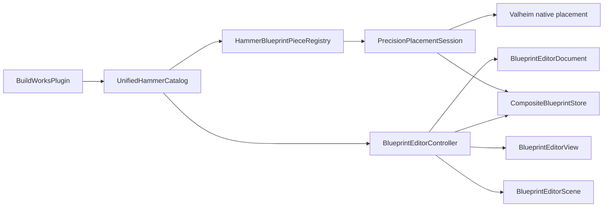

# BuildWorks Architecture

**English** | [Русский](ARCHITECTURE_RU.md)

BuildWorks has two assemblies. `BuildWorks.dll` integrates with Valheim and Unity. `BuildWorks.Geometry.dll` contains deterministic, engine-independent calculations and document operations. Keep host objects out of the geometry assembly so its tests remain executable without Valheim.

## Runtime map

| Responsibility | Start here | Closely related files |
|---|---|---|
| Plugin lifecycle, config, Harmony composition | `BuildWorksPlugin.cs` | `BuildWorksLocalization.cs` |
| Indexed Hammer and native Hammer adapter | `UnifiedHammerCatalog.cs` | `HammerBlueprintPieceRegistry.cs` |
| World F9 editing and sequential placement | `PrecisionPlacementSession.cs` | `PrecisionPlacementHudView.cs`, `TransformGizmoView.cs`, `PlacementGhostPreviewView.cs` |
| Blueprint persistence and format migration | `CompositeBlueprintStore.cs` | `BlueprintThumbnailRenderer.cs` |
| Isolated Blueprint Editor orchestration | `BlueprintEditorController.cs` | `BlueprintEditorInput.cs` |
| Editor UI and Outliner | `BlueprintEditorView.cs` | `BlueprintEditorSkin.cs`, `BlueprintEditorIconLibrary.cs` |
| Editor camera, temporary objects, hit tests and snapping | `BlueprintEditorScene.cs` | `BlueprintEditorMeshData.cs` |
| Deterministic blueprint document, Undo/Redo and hierarchy | `BuildWorks.Geometry/BlueprintEditorDocument.cs` | `AnchorAdjustment.cs`, `ConstructionLayout.cs` |
| Localization | `BuildWorksLocalization.cs` | `Translations/English.tsv`, `Translations/Russian.tsv` |

## Main flows

The indexed Hammer never places a blueprint by itself. It selects a normal piece or a registered blueprint marker. `PrecisionPlacementSession` owns the world ghost, F9 state and native placement sequence. Final construction must continue through Valheim's resource, permission and networking paths.

The Blueprint Editor is isolated from the world session. `BlueprintEditorController` coordinates input, view and temporary scene objects. The authoritative editable state is `BlueprintEditorDocument`; UI objects are projections of that state. Persistence only crosses through `CompositeBlueprintStore`.

## Invariants

- Do not add a hard Jotunn dependency.
- Do not mutate source prefabs to add editor-only snap points.
- Keep one Undo entry per user operation.
- Keep the world blueprint anchor independent from group pivots.
- Treat `CompositeBlueprintStore` migrations and atomic writes as data-safety code.
- Route player-facing text through `BuildWorksLocalization`; logic and sorting use stable IDs, never translated labels.
- Do not start roadmap stages while fixing the current verified baseline.

## Working in large orchestrators

`PrecisionPlacementSession`, `BlueprintEditorView`, `UnifiedHammerCatalog`, and `BlueprintEditorController` are large because their behavior is tightly coupled to Valheim/Unity lifecycle state. Do not split them only to reduce line counts. Extract code when a boundary is independently testable and the extraction removes duplicated ownership. Before changing a shared helper, search all callers and preserve the relevant HostContract assertion.

`AdaptiveGablePiece.cs` and `BuildWorks.Geometry/AdaptiveGablePanel.cs` are retained research prototypes and are explicitly excluded by their project files. They are not shipped runtime behavior. Do not re-enable them while fixing the verified core; the adaptive-piece roadmap requires a separate contract and acceptance pass.

## Where to add common changes

- New player-facing text: both TSV catalogs, then `scripts/Test-Localization.ps1`.
- New pure transform/layout math: `BuildWorks.Geometry` plus one focused GeometryTest.
- New saved field: store DTO, validation, clone/migration, StoreTest, then runtime binding.
- New editor command: document transaction first, controller binding second, view last.
- New Hammer group/material rule: stable ID in `HammerCatalogOrganizer`, localized label in TSV.
- Host API adaptation: one reflection/Harmony boundary, guarded by `Test-HostContract.ps1`.
