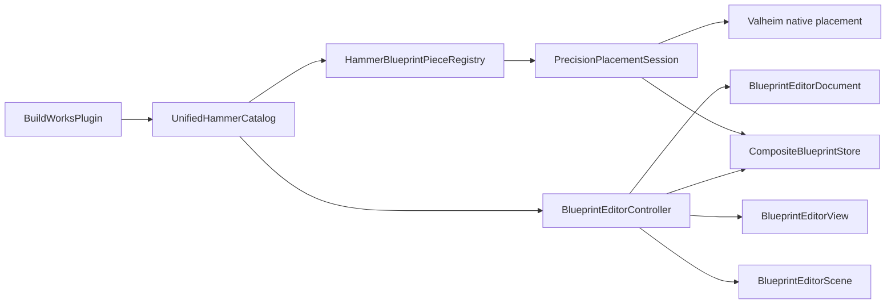

# BuildWorks Architecture

**English** | [Русский](ARCHITECTURE_RU.md)

BuildWorks has two assemblies. `BuildWorks.dll` integrates with Valheim and Unity. `BuildWorks.Geometry.dll` contains deterministic, engine-independent calculations and document operations. Keep host objects out of the geometry assembly so its tests remain executable without Valheim.

## Runtime map

| Responsibility | Start here | Closely related files |
|---|---|---|
| Plugin lifecycle, config, Harmony composition | `BuildWorksPlugin.cs` | `BuildWorksLocalization.cs` |
| Indexed Hammer and native Hammer adapter | `UnifiedHammerCatalog.cs` | `HammerBlueprintPieceRegistry.cs` |
| World F9 editing and sequential placement | `PrecisionPlacementSession.cs` | `PrecisionPlacementHudView.cs`, `TransformGizmoView.cs`, `PlacementGhostPreviewView.cs` |
| Blueprint persistence and format migration | `CompositeBlueprintStore.cs` | `BlueprintThumbnailRenderer.cs` |
| Isolated Blueprint Editor orchestration | `BlueprintEditorController.cs` | `BlueprintEditorInput.cs` |
| Editor UI and Outliner | `BlueprintEditorView.cs` | `BlueprintEditorSkin.cs`, `BlueprintEditorIconLibrary.cs` |
| Editor camera, temporary objects, hit tests and snapping | `BlueprintEditorScene.cs` | `BlueprintEditorMeshData.cs` |
| Deterministic blueprint document, Undo/Redo and hierarchy | `BuildWorks.Geometry/BlueprintEditorDocument.cs` | `AnchorAdjustment.cs`, `ConstructionLayout.cs` |
| Localization | `BuildWorksLocalization.cs` | `Translations/English.tsv`, `Translations/Russian.tsv` |
| Display-only blueprint requirements | `BlueprintResourceHudView.cs` | `HammerBlueprintPieceRegistry.cs`, `PrecisionPlacementSession.cs` |

## Main flows

```mermaid
flowchart LR
    P[BuildWorksPlugin] --> H[UnifiedHammerCatalog]
    H --> R[HammerBlueprintPieceRegistry]
    H --> E[BlueprintEditorController]
    R --> W[PrecisionPlacementSession]
    E --> D[BlueprintEditorDocument]
    E --> V[BlueprintEditorView]
    E --> S[BlueprintEditorScene]
    E --> B[CompositeBlueprintStore]
    W --> B
    W --> N[Valheim native placement]
```

The indexed Hammer never places a blueprint by itself. It selects a normal piece or a registered blueprint marker. `PrecisionPlacementSession` owns the world ghost, F9 state and native placement sequence. Final construction must continue through Valheim's resource, permission and networking paths.

The Blueprint Editor is isolated from the world session. `BlueprintEditorController` coordinates input, view and temporary scene objects. The authoritative editable state is `BlueprintEditorDocument`; UI objects are projections of that state. Persistence only crosses through `CompositeBlueprintStore`.

Editor G/R/S reuse the existing drag snapshots and `Scene.PreviewTransform`;
they do not edit the document until one atomic confirmation. Current-frame surface
validation owns Enter/click, camera/source changes rebase the preview, and cancel
restores the scene. `TransformGizmoView.Family` gates both drawing and hit tests;
world callers retain Combined and their existing behavior. Dropdowns reparent
existing controls rather than duplicate handlers. Layout state is editor-only.

## Invariants

G cursor movement queries the existing scene contact/snap data. Auto/native-only
source policy and the chooser are editor state, not blueprint format fields.
Explicit sources are retained by selected IDs across G/R/G. Selected A overrides
object/group fallback pivots and is the default G source grip; target capture never
replaces it. Optional B defines working X along A→B, not an alignment/curve tool.
The immutable operation snapshot owns exact values and cancel. Frame enum and
local-space flag switch together; View/Edge restore on repeated axis and Esc.
Confirm owns one document transform; UI clicks cannot confirm it.

Editor points use two provenance signs (native/helper), near-cursor reveal and
persistent A. Native-only applies to Auto/Q/E source sets and targets; explicit
helper A is a visible intentional exception. A retained helper outside the current
geometry set carries an override, so it cannot be relabelled as a native socket.
Screen size uses camera projection; model size uses rotation-independent local
renderer dimensions and the selected model scale, frozen during a preview.
Drawing and projected hit areas consume that same size. World/F9 is unchanged.
Model-relative sizing is the editor default; the shared Native/Native+ours flag
owns both G source choice and target scans, with no independent helper opt-in.
The amber native clasp and ivory generated knot encode provenance; the selected
locking collar is an overlay, not a new point type. Optional B lives in Attachment.
Ordinary helpers retain bounds corners, edge middles, centre and generated snap
middles. Optional mesh corners are extra editor-only coordinates, never saved.
They are calculated lazily per visual: welded feature edges, turns at least 45°,
up to 128 spatially sampled existing vertices. Corners strictly inside closed
connected components are removed, including combined meshes; open/non-manifold
components conservatively do not hide corners. Overlaps within 5 mm of ordinary/
native points are omitted. Selection budgets remain 512 helpers/512 native points;
large meshes can omit corners. Legacy Array/save retain their exact old layout.
Experimental range metadata stays frozen during previews. Ordinary helpers use
the ivory knot; experimental ones use small translucent warm dots, depth fade
and a selected collar. Picking uses their projected size, including screen mode.
Target classification excludes moving selection and prioritizes ordinary/native
targets: an aligned source cannot relabel the target. Toggle clears the cache
and is locked during transformations.
G prioritizes explicit pointer aim within 24 px and 2 m of a source; unaimed
capture keeps 0.55 m acquire/0.7 m retention. The winning target is always shown.
View-frame Z uses a separate screen-facing depth handle and vertical mouse motion;
exact input and cancel still consume the immutable operation-start snapshot.
Catalogue labels resolve stable native type/material IDs; unknown/external IDs
and user categories retain their original names.

World requirements reuse native Hud cells and InventoryGui formatting.
`BlueprintResourceHudView` owns only cloned overflow cells and the temporary
scroll viewport, restoring native parents/geometry on every exit. The session
caches aggregate resources by marker/language, but recomputes availability live.
Marker costs stay empty: the adapter never consumes or assigns resources.

- Do not add a hard Jotunn dependency.
- Do not mutate source prefabs to add editor-only snap points.
- Keep one Undo entry per user operation.
- Keep the world blueprint anchor independent from group pivots.
- Treat `CompositeBlueprintStore` migrations and atomic writes as data-safety code.
- Route player-facing text through `BuildWorksLocalization`; logic and sorting use stable IDs, never translated labels.
- Do not start roadmap stages while fixing the current verified baseline.

## Working in large orchestrators

`PrecisionPlacementSession`, `BlueprintEditorView`, `UnifiedHammerCatalog`, and `BlueprintEditorController` are large because their behavior is tightly coupled to Valheim/Unity lifecycle state. Do not split them only to reduce line counts. Extract code when a boundary is independently testable and the extraction removes duplicated ownership. Before changing a shared helper, search all callers and preserve the relevant HostContract assertion.

`AdaptiveGablePiece.cs` and `BuildWorks.Geometry/AdaptiveGablePanel.cs` are retained research prototypes and are explicitly excluded by their project files. They are not shipped runtime behavior. Do not re-enable them while fixing the verified core; the adaptive-piece roadmap requires a separate contract and acceptance pass.

## Where to add common changes

- New player-facing text: both TSV catalogs, then `scripts/Test-Localization.ps1`.
- New pure transform/layout math: `BuildWorks.Geometry` plus one focused GeometryTest.
- New saved field: store DTO, validation, clone/migration, StoreTest, then runtime binding.
- New editor command: document transaction first, controller binding second, view last.
- New Hammer group/material rule: stable ID in `HammerCatalogOrganizer`, localized label in TSV.
- Host API adaptation: one reflection/Harmony boundary, guarded by `Test-HostContract.ps1`.
