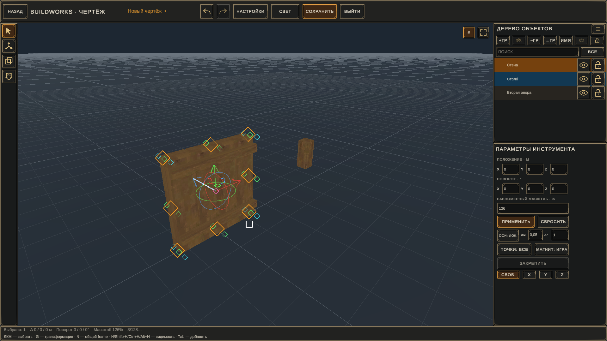
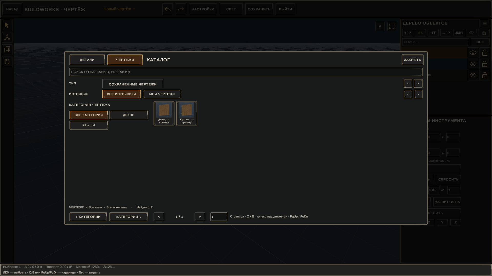
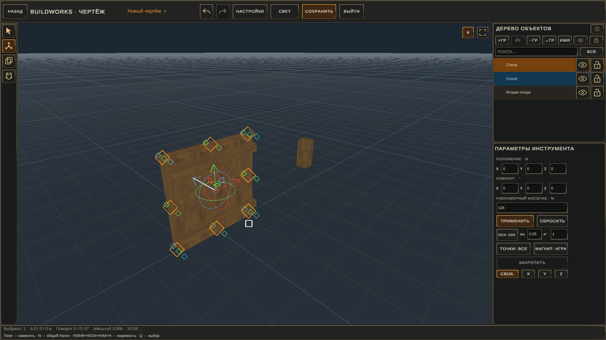
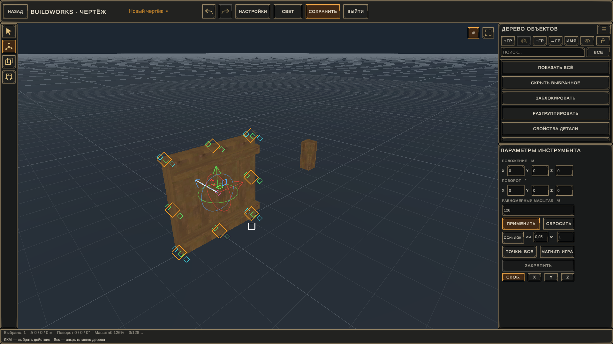
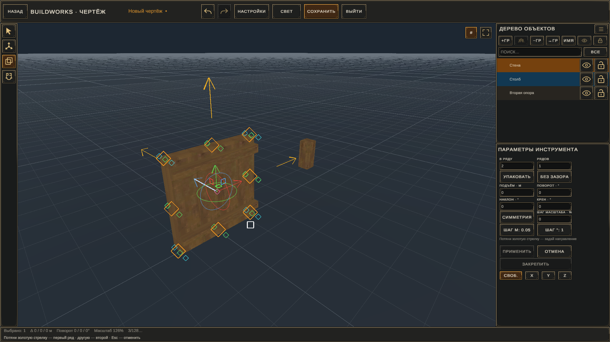
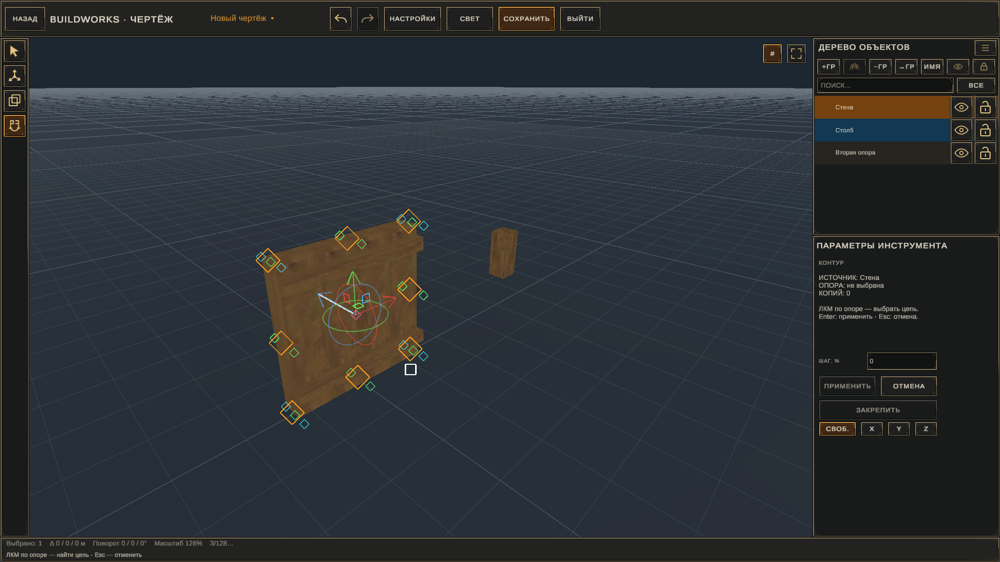

# Функции и взаимодействия BuildWorks

Статусы в этом документе относятся к альфе 0.19.33:

- **реализовано** — функция присутствует в сборке;
- **автоматически проверено** — пройдены детерминированные или Unity/host-проверки;
- **игровая проверка ожидается** — нужен ручной тест в Valheim.

## 1. Индексный молоток

BuildWorks открывает собственный индекс поверх строительного меню: детали можно просматривать по категориям, материалам, недавним и избранному. Есть поиск, счётчики и отдельный вход в библиотеку чертежей. DeepNorth-детали, относящиеся к строительству, объединяются со строительной категорией вместо отдельной технической вкладки.

Средняя кнопка мыши использует native-хранилище избранного Valheim; звезда обновляется в текущем интерфейсе. Выбор карточки закрывает меню и возвращает обычный placement ghost — сама деталь не должна строиться до ЛКМ в мире.

**Статус:** реализовано; базовый игровой сценарий принят. После обновлений Valheim меню требует повторной короткой проверки.

## 2. Библиотека чертежей

Библиотека показывает сохранённые чертежи карточками с превью, названием, категорией и количеством деталей. Доступны размещение, редактирование, переименование, смена категории, обновление превью, просмотр ресурсов и удаление.

Двойной ЛКМ начинает размещение. Удержание ПКМ открывает контекстное меню у курсора; команда выбирается наведением и отпусканием кнопки. `Выбрать в мире` переводит игрока в режим набора существующих деталей без случайной установки ранее выбранного ghost.

**Статус:** реализовано; основные игровые взаимодействия приняты.

## 3. Создание чертежа

Есть два пути:

1. Создать пустой чертёж и добавлять детали из каталога редактора.
2. Выбрать существующие детали в мире, сохранить выбор и открыть его в редакторе.

Выбор в мире подсвечивает детали и сохраняет настоящие prefab identity и относительные transforms. Состав не превращается в одну модель.

**Статус:** реализовано; выбор из мира и переход в редактор приняты.

## 4. Отдельный редактор

Редактор изолирован от игрового мира. В нём есть viewport, сетка, управляемая камера, освещение, каталог, дерево объектов, параметры активного инструмента и постоянно обновляемая нижняя строка доступных действий.

Настраиваются масштаб интерфейса 60–140%, проекция, свет, сетка и размер визуальных ручек. Временные объекты редактора уничтожаются при выходе и не становятся world objects.

**Статус:** реализовано и автоматически проверено на 1920×1080, 2560×1440 и 3440×1440.

## 5. Каталог редактора и установка деталей

`Tab` открывает каталог деталей и сохранённых чертежей. Поиск работает по названию, prefab и источнику; доступны фильтры и страницы. Vanilla building pieces показываются первыми.

В режиме размещения колесо вращает деталь, Q/E переключает исходную snap point, СКМ удаляет наведённую уже установленную деталь, ЛКМ ставит preview. Для мебели/декора без native snap points редактор создаёт только временные точки: низ-центр, четыре нижних угла, центр и верх-центр.

**Статус:** реализовано и автоматически проверено; новое surface-contact/QE-поведение 0.19.33 ожидает игровой smoke.

## 6. Выбор и точная трансформация

Можно выделять одну деталь, несколько деталей, группу или поддерево. Доступны:

- перемещение по X/Y/Z;
- вращение вокруг X/Y/Z;
- равномерный масштаб 1–400%;
- числовой ввод и drag/scrub значений;
- локальные или мировые оси;
- свободное движение либо ограничение одной осью;
- шаги расстояния и угла;
- native mesh snap и BuildWorks snap points;
- закрепление выбранной точки;
- Alt-drag для копии;
- один Undo на завершённое действие.

`N` временно показывает общий frame выбранного набора вместо назначенной опоры, не меняя сохранённый документ.

**Статус:** реализовано; numeric transform, frame override, копирование и Undo автоматически проверены, основные игровые сценарии приняты.

## 7. Дерево объектов и группы

Дерево показывает детали, группы и вложенность. Поддерживаются выбор диапазона, поиск, фильтры, drag/drop, создание и удаление групп, перенос, группировка/разгруппировка, переименование, дублирование, скрытие и блокировка.

Контекстное меню дерева содержит только операции структуры. Оно открывается удержанием ПКМ в точке курсора; нужная команда выполняется при отпускании над ней.

### Опоры

- **Опора группы** задаёт pivot локальных преобразований выбранной группы; двигаются все её потомки.
- **Опора чертежа** может быть любой одной деталью документа и определяет мировой frame и snap points при размещении всего чертежа.
- Если опора не задана, используется общий bounds-center соответствующей группы или всего чертежа.

Удаление, перенос, duplicate и Undo корректно очищают или переназначают ссылки опор.

**Статус:** реализовано; Store v9, hierarchy/remap и pointer regressions автоматически проверены. Полный multiplayer/reload gate ещё впереди.

## 8. Array

Array повторяет выбранную деталь или группу в ряд либо плоскость. Золотые стрелки задают направления. Параметры:

- количество в ряду и количество рядов;
- `УПАКОВАТЬ / БЕЗ ЗАЗОРА` — естественный постоянный шаг;
- `ПО ДЛИНЕ` — копии распределяются между фиксированными концами;
- `ТОЧНЫЙ ШАГ`;
- подъём;
- поворот, наклон и крен каждой следующей копии;
- шаг масштаба;
- симметрия.

Preview меняется во время числового scrub, но документ изменяется только один раз при `Применить`. Вся операция отменяется одним Ctrl+Z.

**Статус:** математика и Unity regressions PASS. Сброс свежего Array и Pack/Fit 0.19.33 ожидают ручной smoke.

## 9. Contour

Contour берёт выбранную деталь или группу как источник и повторяет её вдоль видимой связанной цепочки опорных деталей. Пользователь выбирает целевую цепь в viewport, регулирует шаг и подтверждает один atomic commit.

**Статус:** реализовано и автоматически проверено; расширенные кривые и редактируемые guide nodes пока не входят в этот инструмент.

## 10. Точное размещение в мире — F9

F9 включает непрерывный precision layer для обычной детали или всего выбранного чертежа. F10 фиксирует текущий ghost для точного редактирования. Левый Alt освобождает курсор для drag ручек. Доступны движение, вращение по трём осям, локальные/мировые оси, шаги, snap points, Array и Contour.

Если у чертежа назначена мировая опора, гизма и world snap используют её. Удержание `N` временно показывает frame всего чертежа без изменения опоры.

**Статус:** мировая точная установка, frame и F9 Array/Contour реализованы; отдельные save/reload и multiplayer gates не закрыты. Игровые изображения будут добавлены после принятия smoke 0.19.33.

## 11. Установка составного чертежа

Один preview представляет весь состав, но подтверждение последовательно строит настоящие детали через native flow Valheim. Проверяются требования, права, stamina, инструмент, clipping и ограничения каждой детали. Если stamina закончилась или молоток сломан, серия может быть продолжена после восстановления. Максимум мирового плана — 512 деталей.

Esc во время незавершённой серии отменяет и уничтожает уже созданные части этой незавершённой попытки; после возврата восстанавливается ghost исходного чертежа.

**Статус:** автоматические lifecycle regressions PASS; полный survival/multiplayer smoke остаётся обязательным.

## 12. Сохранение и совместимость

Чертежи сохраняют prefab identity, transforms, groups, локальные опоры и мировую опору. Старые форматы читаются совместимо без пересчёта координат. BuildWorks не извлекает meshes, textures или материалы чужих модов.

**Пока не реализовано:** надёжный перенос файла между разными наборами модов, dependency manifest, восстановление неизвестных prefab и публичный import/export workflow.

