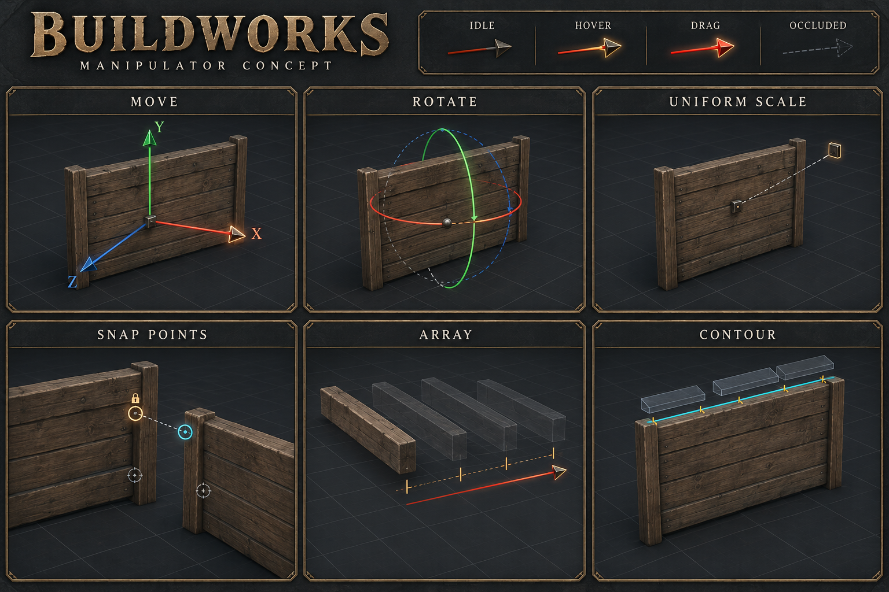

# Предложение по видимости деталей и компактному управлению

[English](editor-visibility-proposal.md) | **Русский**

Проект для согласования, 2026-10-01. По ответу Ostrix принята короткая игровая
серия 0.19.41: неподвижный контур, очистка, читаемые переведённые подсказки,
просвечивание, камера и дерево. Новые пожелания: сворачивать подсказки,
разгрузить манипуляторы, сохранить видимость места стыка и компактнее разместить
настройки вида. Это предложение; изменения не реализованы и не установлены.
По уточнению Ostrix вариант 2 подходит только при быстром выборе действия/оси,
переносе существующей детали как призрака, заметной подсказке следующего шага
и оригинальных ручках в стиле игры. Теперь предложение сохраняет действия G/R/S
по принципу Blender, возвращает прямой выбор постоянных инструментов и добавляет
одно клавиатурное меню для будущего расширения. Оно заменяет отвергнутый проект
Q/W/E/R/T с запуском через Space. Ostrix согласовал направление G/R/S, 1–4 и
Space/F3 2026-10-01 и явно запросил полную перерисовку манипуляторов, не смену цвета.
Конкретный вид и оставшиеся вопросы управления ниже ещё согласуются.

## Почему управление закрывает выбранную деталь

Сейчас редактор одновременно включает перемещение, вращение, плоскости и масштаб.
По умолчанию видны все опоры: 21 точка габарита и внешние штатные точки привязки.
У штатной точки радиус нажатия 36 пикселей при стандартном размере редактора,
у габаритной — 12. Точка получает приоритет перед большинством ручек.
Одно уменьшение прозрачности не устранит перехват нажатий.

Основание: `BlueprintEditorController.cs` (`showAllAnchors`, `TryBeginGizmoDrag`);
`BlueprintEditorScene.cs` (`ShowGizmo`, `TryGetGizmoAnchors`);
`TransformGizmoView.cs` (`Show`, `AnchorHitRadius`, проверки попадания).
Геометрия, опора чертежа, опоры групп и расчёты привязки не меняются.

## Три варианта

| Предложение | Управление | Польза | Цена |
| --- | --- | --- | --- |
| 1 Облегчить общую гизму | Оставить все ручки; показывать точки возле курсора, выбранную и закреплённую; уменьшить значки вместе с областью нажатия | Минимальная правка и почти без переучивания | На маленькой детали соседние точки всё равно скучиваются; стрелки и кольца остаются вместе |
| 2 Явное семейство управления | В трансформации выбрать Перемещение, Вращение или Точки; масштаб доступен явно и через число | Предсказуемые нажатия и видимая деталь; нет скрытого выбора действия | Дополнительное переключение при смене операции |
| 3 Автоматический фокус курсора | Общая гизма остаётся; один кандидат яркий, соседние приглушены, при движении остаются основные отметки | Меньше переключений для опытного игрока | Совпадения требуют устойчивого выбора и доступа к альтернативам; самый сложный вариант |

После повторного разбора маленьких деталей и плотных групп рекомендуем **2**.
Первый вариант в основном облегчает рисунок; третий переносит сложность в скрытое
поведение. Явное семейство показывает доступное действие ещё до нажатия.

## Предлагаемое поведение манипулятора

Сохранить жесты мира; клавиши отдельного редактора перегруппировать по предложению ниже.
Переключатель и соответствующие клавиши выбирают ручки без движения детали. Перемещение
показывает стрелки/плоскости, Вращение — кольца, Точки — управление привязкой/опорами.
Масштаб остаётся явно доступен. Активная, закреплённая и целевая точки различаются;
обычные точки — маленькие отметки вместо крупных постоянных ромбов.
Подробность точек настраивается в панели манипулятора, не поверх модели.

Переключение рисунка не меняет выделение, закреплённую точку, документ и историю.
Отображение и проверка нажатий используют одно состояние: невидимая ручка не
перехватывает клик. Старое поведение мира/F9 не меняется. Массив, Контур и добавление
сохраняют своё обязательное управление. Новая система манипуляторов и замена
математики привязок не нужны.

## Предлагаемый путь действие затем ось

Направление клавиш согласовано владельцем, но ещё не реализовано. Разделить прямое действие и
постоянный инструмент: G/R/S сразу начинает временный предпросмотр, выбор
инструмента меняет его ручки без изменения геометрии. Ни один путь не требует
предварительно нажать панель или Space для запуска трансформации.

| Ввод при редактируемом выделении | Предлагаемое следующее действие |
| --- | --- |
| G / R / S без операции | Сразу начать предпросмотр Перемещения / Вращения / Равномерного масштаба |
| Верхний ряд 1 / 2 / 3 / 4 без операции | Выбор / Гизма / Массив / Контур; Гизма помнит последнее семейство ручек |
| Space без операции | Открыть Инструменты под курсором; выбрать указанной клавишей или мышью |
| F3 без операции | То же окно Инструменты с активным поиском; имя, стрелки и Enter для выбора |
| X/Y/Z при переносе или вращении | Выбрать ось; повтор переключает текущие/альтернативные мировые-локальные оси с явной подписью |
| Shift+X/Y/Z при переносе | Плоскость без этой оси |
| ЛКМ во вьюпорте или Enter при предпросмотре с клавиатуры | Один раз подтвердить; стартовый клик UI не подтверждает |
| Esc | Точно вернуть исходное состояние, сохранив выделение |

Примеры: выделил стену → G → навёл на соседнюю → ЛКМ. Точный сдвиг:
G → X → движение мыши → Enter. Поворот: R → X → движение → Enter.
Обычное перетаскивание ручки подтверждается отпусканием ЛКМ, Enter не требуется.
Масштаб равномерный: S → X/Y/Z не предлагается; неравномерный масштаб вне задачи.
Поведение глубины свободного G и вращения без ограничения R нужно определить
до обещания третьего нажатия оси для снятия ограничения, как в Blender.
В Valheim вверх — Y, в Blender — Z; вращение относительно экрана нельзя молча
считать вращением вокруг мировой Y. F9 может остаться совместимым входом в Гизму;
дубли не занимают главную подсказку. Tab — каталог, старый Shift+A — совместимое сочетание.

1–4 — наше предложение, не раскладка инструментов Blender; цифровой блок клавиатуры
автоматически не подключать. A становится Выбрать всё, Массив переходит на 3;
C может остаться совместимой клавишей Контура, не второй основной подсказкой.
Не перенумеровывать инструменты и не занимать 5–0 под вымышленные инструменты.
Новые получают постоянный идентификатор команды и появляются в Инструментах;
прямую клавишу можно назначить без вытеснения старых/пользовательских назначений.
Использовать нынешнее перечисление инструментов и запланированные настройки
клавиш, не новый фреймворк.

Space → указанная клавиша — последовательные нажатия, не удерживаемое сочетание.
Вне меню буквы свободны для текста. Поиск получает ввод только при явном выборе
поля или через F3; одна буква не должна одновременно выбирать инструмент и
печататься в поиске. Оба пути вызывают те же обработчики инструментов.
Blender предлагает такой подход как настраиваемое действие Spacebar Action
**Tools**, не стандартное Play:
[Blender Keymap](https://docs.blender.org/manual/vi/5.2/editors/preferences/keymap.html).
[Поиск F3](https://docs.blender.org/manual/en/3.6/interface/controls/templates/operator_search.html)
позволяет находить команду по имени. Для ориентации осей берём
[принцип Blender Axis Locking](https://docs.blender.org/manual/en/5.2/scene_layout/object/editing/transform/control/axis_locking.html),
с оговоркой о ещё не согласованном свободном действии.

Приоритет ввода явный: активные UI/текст/диалог/каталог, затем навигация камеры
над вьюпортом, затем текущий предпросмотр, затем инструменты без операции.
При переносе по поверхности/добавлении Q/E/колесо сохраняют строительный смысл,
не переключают инструменты.
Возврат из навигации/UI возобновляет движение без скачка; клавиши инструмента
не попадают в текстовые поля или сессию мира. Во время предпросмотра
сохранение/история/каталог/смена выделения не должны подтвердить или отменить другую
правку; показать Сначала подтвердите или отмените. Это включает смену инструмента,
Space/F3 и новое действие G/R/S, кроме контекстного выбора точки Q/E. Числа во
время трансформации оставлены для числового ввода, не выбора 1–4; это требование
будущего ввода, не уже выпущенная функция. Esc и потеря фокуса приложения
отменяют. Навигация замораживает перенос и возобновляет без скачка. При смене оси,
системы координат или исходной точки расчёт начинается от текущего предпросмотра.

## Остальные команды клавиатуры и мыши

Сохранить привычные команды, не переносить каждую клавишу только ради компактности:
A всё (Ctrl+A совместимость), Ctrl+D копия, Ctrl+G группа, Ctrl+S сохранить, Ctrl+Z отменить,
Ctrl+Y или Ctrl+Shift+Z вернуть. Сочетания имеют приоритет перед одиночной клавишей.
F центрирует выделение, Home всё. H/Shift+H/Ctrl+H/Alt+H сохраняют скрытие/изоляцию/
всё кроме выбранного/показать всё; F7 просвечивание. N остаётся временным общим
центром, Shift+S переводит ввод в поле шага. Числа не заменяют геометрические X/Y/Z.

Мышь намеренно разделяет навигацию и удаление: СКМ вращает камеру,
Shift+СКМ сдвигает, ПКМ+WASD/QE полёт, колесо приближение, Shift при полёте ускорение.
Delete — единственная клавиша удаления во вьюпорте редактора; убрать удаление
коротким СКМ там, в том числе при добавлении, чтобы неудачное вращение камеры
не удаляло деталь. В мире удаление СКМ не меняется. Это отличие требует явного согласования.
Ctrl+колесо всегда приближает камеру редактора; обычное колесо вращает при переносе
по поверхности/добавлении, меняет количество в Массиве, иначе приближает. При
предпросмотре навигация приостанавливает/пересчитывает движение без скачка;
не подтверждает, не удаляет и не открывает каталог. Короткий ПКМ над свободным
вьюпортом без операции сохраняет каталог; в дереве ПКМ остаётся контекстным меню.
Панели обрабатывают свою прокрутку и жесты мыши.

ЛКМ выбор, Ctrl/Shift+ЛКМ добавление к выбору, рамка по пустоте, Alt+стрелка
копия, Shift+точка закрепление и Ctrl+перетаскивание точки магнит остаются
контекстными жестами. Не делать Ctrl глобальным переключателем магнита: он уже
участвует в тексте/выборе. Массив/Контур сохраняют Enter применить и Esc отменить;
Space не запускает вторую операцию. Новое добавление повторяется по ЛКМ;
подтверждение переноса существующего завершает одну правку. Esc без операции
сохраняет нынешнее снятие выделения/выход.

В Настройках — один список сочетаний по контекстам с переназначением и сбросом,
как уже запланировано в BW-01. Конфликты пересекающихся контекстов запрещать
или явно разрешать; сброс не уничтожает сохранённые пользовательские назначения молча.
Подписи и подсказки берут действующую клавишу, не фиксированный текст. В EN/RU
показывать латинские имена клавиш; работу Unity на русской и английской раскладке
проверить отдельно, не обещать физическое поведение по имени KeyCode.
Это требование будущих настроек, не реализованный сервис. Space/F3 используют
один список инструментов; не добавлять вторую палитру команд, наборы раскладок,
клавиатурный фреймворк или переназначение мира в этот проход.

## Перенос существующих деталей как призрака

Следование поверхности ближе к строительству. Плоскость параллельно экрану
стабильнее, но прячет управление глубиной. Предлагается Поверхность с явным
запасным способом Плоскость, не автоматическая смена. Начальный способ G и
управление глубиной ещё согласуются. Ограничения оси/плоскости используют
выбранные мировые/локальные оси.

Начать с выбранной точки, иначе текущей опоры выделения; исходное положение
сохраняется до намеренного движения мыши. Исключить все перемещаемые детали из
попаданий по поверхностям/целям, чтобы не ловить самих себя. Сохранить нынешние
расстояния показа/захвата и правила исходных точек. Q/E выбирают исходную точку,
колесо поворачивает вокруг неё с шагом обычного добавления. Эти жесты действуют
в переносе по поверхности, не во Вращении/Масштабе и не при полёте камеры.
Не вводить автоматическое выравнивание по нормали.

Только при переносе по поверхности её потеря сохраняет последний предпросмотр,
запрещает подтверждение и показывает Нет поверхности. Дать явно выбрать плоскость.
Осевой перенос и явно выбранная плоскость подтверждают корректный результат и без
поверхности под курсором. Не прыгать на далёкую землю. Почти параллельный луч
при ограничениях тоже обрабатывается безопасно.
Ось/плоскость важнее магнита: внеосевая цель не притягивает. Это новое предлагаемое
правило взаимодействия, не косметика.

Один раз зафиксировать редактируемые stable IDs, исходные трансформы и временные
опору/закрепление/ограничения. Предпросмотр — существующий Scene.PreviewTransform;
подтверждение — один ApplyTransformDelta документа. Отмена восстанавливает из документа.
Не подтверждать через HandlePartPlacement/AddPart/InsertBlueprint.
Без новых ID, удаления/пересоздания, переназначения опор и изменения Store.
Сохранить взаимное положение группы; нулевая правка не меняет dirty-state и не
создаёт Undo. Панели приостанавливают перенос, не подтверждают и не пропускают клики.
Здесь речь о деталях отдельного редактора, не уже построенных объектах мира.

## Заметная подсказка следующего шага

Одна контрастная строка действия с золотистым акцентом остаётся даже при свёрнутой
справке. Жирный глагол и оформленные клавиши, без мигания. Показывать только
осмысленные продолжения текущего состояния:

| Состояние | Пример подсказки |
| --- | --- |
| Выделение | Стена выбрана · G Перемещение · R Вращение · S Масштаб · Space Инструменты |
| Выбор постоянного инструмента | 1 Выбор · 2 Гизма · 3 Массив · 4 Контур; выделить активный |
| Перенос по поверхности | Наведи на поверхность · X/Y/Z ось · Q/E исходная точка |
| Перенос по оси | Движение по X · Мир · X переключить на Локальные · Enter подтвердить · Esc вернуть |
| Цель найдена | Цель: стена · Точка 3/8 · ЛКМ/Enter подтвердить · Esc вернуть |
| Цель потеряна | Нет поверхности · Наведи в другое место или выбери Плоскость · Esc вернуть |
| Подтверждено | Перемещено · Ctrl+Z отменить, затем подсказка выделения |

Оси доступны и кнопками, не только клавиатурой. Строки будут локализованы;
эти примеры не новые runtime-ключи. Не красить все команды одинаково ярко.
Ошибки объяснять текстом/значком, не одним цветом. Раскрытые шесть групп остаются
справкой, не главной инструкцией. В компактном низу отделить выбор инструмента,
текущее действие и подтверждение/отмену; показывать актуальный блок и следующий шаг,
не весь список клавиатуры.

## Оригинальные манипуляторы в стиле игры

Перерисовать весь набор нынешних ручек: стрелки и плоскости перемещения,
дуги вращения, равномерный масштаб, исходные/закреплённые/целевые точки,
направление/шаг Массива и направляющие Контура. Это не простая смена палитры.
Небольшие скошенные наконечники из тёмного металла, тонкие дуги, открытые метки
точек и сдержанная бронзовая окантовка продолжают стиль рамок BuildWorks,
без тяжёлых орнаментов поверх модели. Сохранить различимые XYZ/подписи,
Y вверх и читаемую деталь.

| Ситуация | Предлагаемая отрисовка |
| --- | --- |
| Активное семейство без действия | Тонкие приглушённые линии цвета оси, тёмный контрастный край, компактные металлические наконечники; открытый центр |
| Наведение | Более чёткий яркий край и небольшое усиление одной доступной ручки; узкое тёплое свечение, не засветка сцены |
| Перетаскивание | Выразительная активная ось/ручка и точная направляющая; только нужные исходная, закреплённая и целевая метки |
| За геометрией | Тусклое прерывистое продолжение для ориентации, чёткие передние участки; не одинаково яркое кольцо сквозь деталь |
| Неактивное семейство | Скрыто, не прозрачная куча конкурирующих ручек; информационные метки опоры/цели могут остаться |
| Привязка или раскладка | Маленькие различимые исходная/целевая метки, редкие соседние кандидаты, отметки Массива вне силуэта, Контур на настоящем ребре |

Отклик наведения не зависит от игрового bloom: небольшая рисуемая светлая кайма
должна читаться и без него. Контраст — основа, свечение его дополняет.
Использовать нынешнюю отрисовку и небольшие оригинальные формы, не импортированные
манипуляторы DCC, новый фреймворк или замену математики привязок. Общая отрисовка
обслуживает и мир/F9: сначала управление редактора, сохранить жесты/настройки мира,
а общие визуальные правки проверить в обоих контекстах до установки.

Наведение не расширяет область нажатия и не меняет победителя среди ручек.
Скрытые семейства не ловят клики; оставшиеся отметки закрепления информационные,
если активное семейство не разрешает их менять. Конкретные цвета/прозрачность/иконки
согласовать на визуальном макете до реализации. Сгенерированный концепт задаёт
художественное направление, не доказывает глубину Unity, нажатия, свечение и
производительность. Их отдельно проверяет настоящий runtime Workbench: маленькие/
большие детали, совпадающие точки, дерево, светлая земля и тёмная сетка,
перспектива/ортография и поддерживаемые масштабы. Ресурсы Blender/Houdini/модов не копировать.

Макет для визуального согласования создан встроенной генерацией изображений
2026-10-01: шесть нынешних семейств, покой/наведение/перетаскивание/перекрытие,
тёмный металл и бронза, редкие точки и видимая древесина. Геометрия, материалы и
расположение направляющих иллюстративные, не точная отрисовка игры и не правка
данных привязки. Это не лист текстур ручек: согласованные формы реализуются
нынешней отрисовкой и проверяются в Unity. Визуальное согласование ещё ожидается.

## Предлагаемый контекст просвечивания

Сохранить принятое поведение F7. Когда известна текущая цель привязки, рисовать
только сдержанный контур её формы и активную точку, даже если сплошная модель
временно скрыта. Не показывать каркас всех скрытых объектов. Это ориентир места
стыка, не точное вычисление пересечения моделей. Для проверки настоящего соединения
выключить F7 и повернуть камеру.

Есть отдельное ограничение: `IsEditorPointVisible` продолжает учитывать временно
скрытые перекрытия, а поиск целей использует этот фильтр. F7 не гарантирует доступ
ко всем внутренним точкам. Ради визуального контура нельзя молча менять доступность
целей. Выбор внутренних точек требует отдельного решения об управлении и проверки.

В этот проход не добавлять переписывание прозрачных материалов, вырезающее окно
в изображении или систему вычисления пересечений моделей.

## Предлагаемые компактные настройки и подсказки

В шапке вьюпорта — три небольших подписанных раскрывающихся меню:
**Камера**, **Отображение**, **Манипулятор**. В Камере — угол обзора, сброс к игре,
проекция и центровка. В Отображении — сетка и F7. В Манипуляторе — семейство,
текущие размеры ручек и подробность точек. Использовать существующие поля/обработчики.
Открывать по клику, закрывать Escape или кликом снаружи, не пропускать этот клик
на модель. Текущее состояние видно в шапке. Иконки оригинальные, в стиле BuildWorks,
с подсказками.

Одна кнопка сворачивает шесть групп подсказок в узкую строку состояния и заметного
следующего шага, включая подтверждение/отмену. Высота действительно возвращается вьюпорту,
а не остаётся пустым местом. Раскрытие возвращает нынешние группы. Ошибки и
инструкции диалогов остаются читаемыми. Не раскрывать всю панель автоматически
при каждой смене инструмента. Настройки UI не меняют сохранённый чертёж и камеру мира.

Ориентир — разделение инструментов и раскрывающихся настроек Blender, а также
разделение видимости управляющих элементов и геометрии Houdini. Это принципы,
не копирование ресурсов и не обещание полного совпадения с этими программами.
Источники: [Blender Gizmos](https://docs.blender.org/manual/en/latest/editors/3dview/display/gizmo.html),
[настройки вида Blender](https://docs.blender.org/manual/en/latest/editors/3dview/sidebar.html),
[наборы управляющих элементов Houdini](https://www.sidefx.com/docs/houdini/character/kinefx/selectionsets.html).

## Пространство вьюпорта и размеры подсказок

Взять из Blender изменяемые границы областей, сворачивание боковых панелей и
разворачивание вьюпорта с возвратом, не всю систему окон. Начать с нынешнего
разделения дерева/параметров и минимальной читаемой ширины. Компактная панель
иконок, раскрывающиеся меню и кнопка Фокус возвращают прежнюю раскладку.
В фокусе сохранить строку следующего действия. Свободное место отдавать модели,
не новым постоянным кнопкам.
[Blender Areas](https://docs.blender.org/manual/en/5.2/interface/window_system/areas.html)
описывает размеры и разворачивание; это предлагаемые адаптации, не готовые функции.
Не копировать N для боковой панели: N уже временно переключает общий центр.

Проверка кода: `BlueprintEditorView` создаёт окно подсказки 250×58 с отступами
10/4 и помещает его в `safeRoot`. `ShowTooltipNow` не измеряет текст и не меняет
размер по содержимому. Риск подтверждён, но конкретная обрезанная строка Ostrix
не воспроизведена. Упрощённый Workbench оценивает ширину по числу символов,
не измеряет реальные знаки. В изученной проверке настоящего runtime UI есть
контроль кнопок/нижних подсказок, но нет отдельной проверки всплывающих подсказок.

Исправить общий расчёт: измерить переведённый текст при ограниченной ширине,
перенести строки, вычислить высоту с отступами, затем разместить измеренную рамку
в безопасной области. Сохранить читаемый шрифт и отсутствие перехвата кликов.
Если текст всё равно не вмещается, сократить подсказку и вынести подробности
в явную справку; не обрезать молча и не уменьшать шрифт до нечитаемого.
Проверять реальные runtime-подсказки, не только упрощённый UI: EN/RU,
поддерживаемые масштабы, узкое окно, углы экрана, длинные имена объектов и
действующие пользовательские клавиши.

## Реализация и согласование

Направление действий G/R/S, постоянных инструментов 1–4 и одного меню Space/F3
согласовано. До реализации определить свободное Перемещение/Вращение и управление глубиной,
СКМ только для камеры редактора, запасную плоскость, контекстные Q/E/колесо,
приоритет ограничений, строку следующего шага и визуальный макет.
Порядок небольших шагов: сворачивание/подсказка; семейства с согласованными
проверками нажатий; перенос существующего выделения с единым подтверждением;
компактные меню; затем контур цели. Каждую видимую правку
показать в существующем Unity Workbench до защищённой установки.

Проверить маленькую стенку, плотные группы, совпадающие точки, закрепление,
привязку к модели, добавление, Массив/Контур и отмену; EN/RU и поддерживаемые масштабы.
Невидимые ручки не ловят клики, панели не пропускают ввод, свёрнутые подсказки
освобождают вьюпорт; камера, документ и мир/F9 не меняются.
Проверить точную отмену/один Undo, нулевую правку, ID/опоры групп, исключение
самопопадания, потерю поверхности, смену оси/координат/точки, полёт/потерю фокуса,
защиту стартового UI-клика и приоритет сочетаний/текста. Проверить клавиши
инструментов против числового ввода, фокус букв/поиска в меню, повтор оси,
приоритет полёта, действующие назначения и измеренные размеры подсказок. Затем отдельная
понятная игровая серия только в TerrainRamp-1.0-Test.
Это предложение не повышает версию, не устанавливает мод и не публикует релиз.
